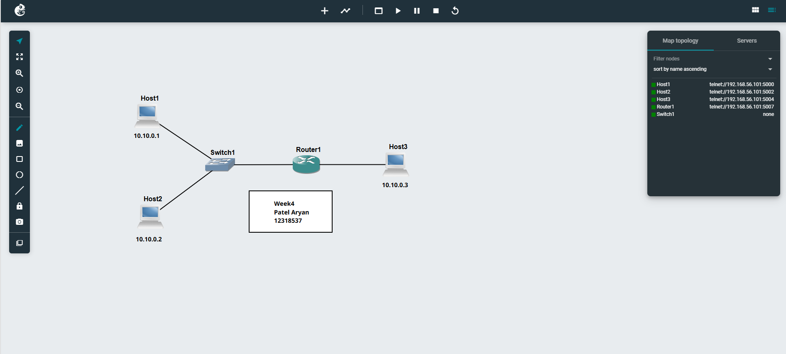
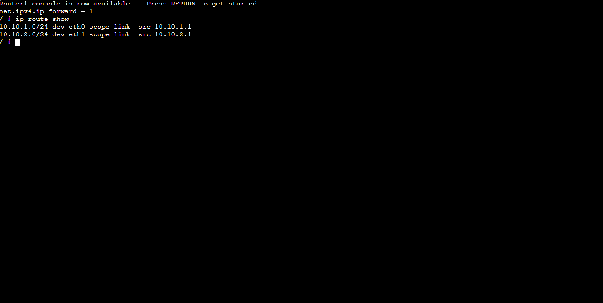
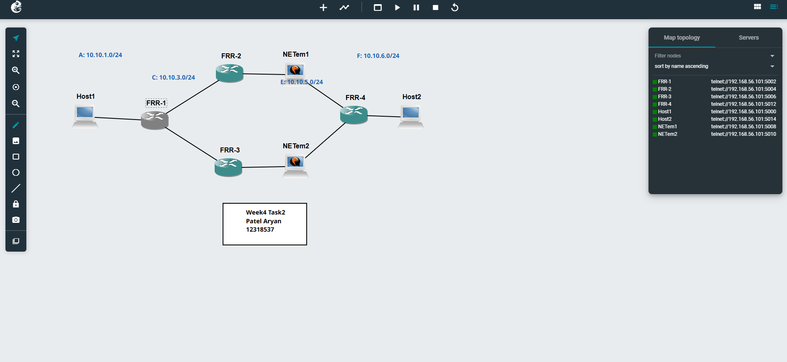
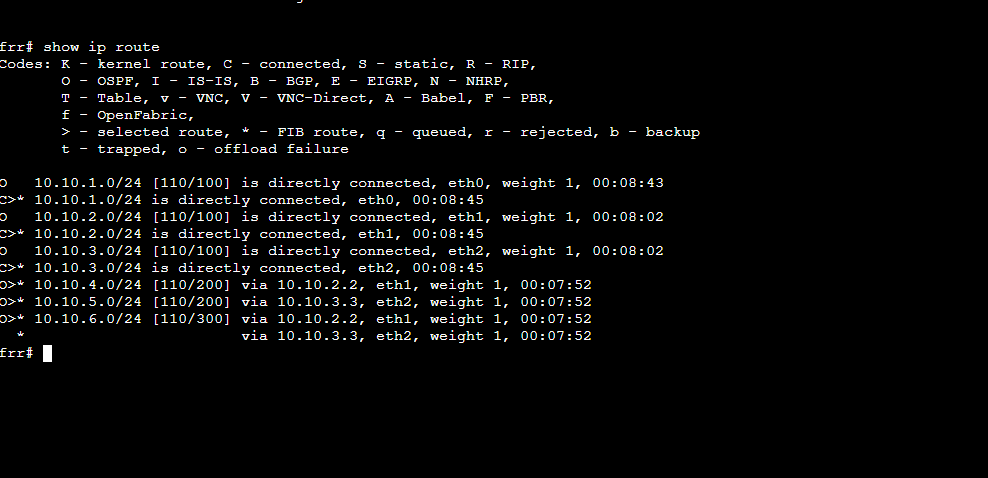
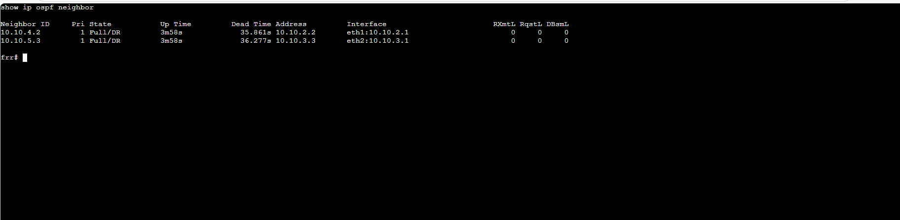
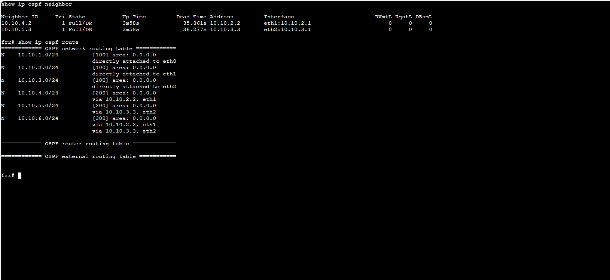

# COIT20261 Week 04 Tutorial — Detailed Guide

* **Name:** Patel Aryankumar ramkrushnbhai
* **Student ID:** 1238537
* **Unit:** COIT20261
* **Campus:** MELBOURNE
* 
## Task 1: View Routing Tables


## Network Topology

You need to build a small network in GNS3 with:



week4Route.png
* 3 Linux Hosts
* 1 Linux Router
* 1 Ethernet Switch

Two hosts and the router connect to the switch on the first subnet.

The third host connects directly to the router on the second subnet.

Example structure:

```text
Host1 ----
           \
Host2 ------ Switch ----- Router ----- Host3
```

This creates:

* Subnet 1: Host1, Host2, Router interface 1
* Subnet 2: Host3, Router interface 2

---

## Example IP Addressing Plan

You may choose your own addresses, but an example is:

| Device | Interface | IP Address   | Subnet      |
| ------ | --------- | ------------ | ----------- |
| Host1  | eth0      | 10.1.1.10/24 | 10.1.1.0/24 |
| Host2  | eth0      | 10.1.1.20/24 | 10.1.1.0/24 |
| Router | eth0      | 10.1.1.1/24  | 10.1.1.0/24 |
| Router | eth1      | 10.2.2.1/24  | 10.2.2.0/24 |
| Host3  | eth0      | 10.2.2.10/24 | 10.2.2.0/24 |

### Default Gateway Settings

Hosts need a default gateway because they rely on the router to reach other subnets.

| Device | Default Gateway |
| ------ | --------------- |
| Host1  | 10.1.1.1        |
| Host2  | 10.1.1.1        |
| Host3  | 10.2.2.1        |

The router itself usually does not need a default gateway in this topology because it is directly connected to both subnets.

---

## Example `/etc/network/interfaces` Configuration

### Host1

```text
auto eth0
iface eth0 inet static
   address 10.1.1.10
   netmask 255.255.255.0
   gateway 10.1.1.1
   up sysctl net.ipv4.ip_forward=0
```

### Host2

```text
auto eth0
iface eth0 inet static
   address 10.1.1.20
   netmask 255.255.255.0
   gateway 10.1.1.1
   up sysctl net.ipv4.ip_forward=0
```

### Router Interface eth0

```text
auto eth0
iface eth0 inet static
   address 10.1.1.1
   netmask 255.255.255.0
   up sysctl net.ipv4.ip_forward=1
```

### Router Interface eth1

```text
auto eth1
iface eth1 inet static
   address 10.2.2.1
   netmask 255.255.255.0
   up sysctl net.ipv4.ip_forward=1
```

### Host3

```text
auto eth0
iface eth0 inet static
   address 10.2.2.10
   netmask 255.255.255.0
   gateway 10.2.2.1
   up sysctl net.ipv4.ip_forward=0
```

---

## Forwarding

Forwarding determines whether a device can pass packets between different networks.

* Hosts should have forwarding disabled (`0`)
* Routers should have forwarding enabled (`1`)

To check forwarding:

```text
sysctl net.ipv4.ip_forward
```

Possible output:

```text
net.ipv4.ip_forward = 1
```

This means forwarding is enabled.

---

## Viewing Routing Tables

To see the routing table on a Linux device:

```text
ip route show


### Example Routing Table on Host1

```text
10.1.1.0/24 dev eth0 proto kernel scope link src 10.1.1.10
default via 10.1.1.1 dev eth0
```

Meaning:

* The first line means Host1 can directly reach devices on 10.1.1.0/24
* The second line means all other traffic goes to the router at 10.1.1.1

### Example Routing Table on Router

```text
10.1.1.0/24 dev eth0 proto kernel scope link src 10.1.1.1
10.2.2.0/24 dev eth1 proto kernel scope link src 10.2.2.1
```

Meaning:

* The router already knows both directly connected networks
* No extra routes are needed because it is connected to both subnets

---

## Ping Testing

You should test:

```text
ping 10.2.2.10
```

from Host1.

If successful, Host1 can communicate with Host3 through the router.

A successful result may look like:

```text
64 bytes from 10.2.2.10: icmp_seq=1 ttl=63 time=2.1 ms
```

This confirms:

* IP addresses are configured correctly
* The default gateway is correct
* Router forwarding is enabled
* The routing tables are working properly

---

# Task 2: Dynamic Routing with OSPF


## Network



## OSPF Overview

OSPF stands for Open Shortest Path First.

It is a dynamic routing protocol that allows routers to:

* Learn about remote networks automatically
* Share routes with neighbouring routers
* Recalculate paths when links fail

Unlike static routing, you do not manually enter every route.

---

## FRR Routers

The routers in the template use FRRouting (FRR).

When the router finishes booting, you should see:

```text
frr#
```

If you instead see:

```text
frr:~#
```

run:

```text
vtysh
```

---

## Important FRR Commands

### View Neighbour Routers

```text
show ip ospf neighbor
```

This command shows:

* Router IDs of neighbours
* IP addresses of neighbour interfaces
* State of the OSPF connection

Example:

```text
Neighbor ID     Pri State           Dead Time Address         Interface
2.2.2.2           1 Full/DR         34.123s   192.168.12.2    eth1
```

`Full` means the OSPF neighbour relationship is working correctly.

---

### View OSPF Routes

```text
show ip ospf route
```


This shows routes learned dynamically through OSPF.

Example:

```text
N IA 10.4.4.0/24 [10] area: 0.0.0.0
     via 192.168.12.2, eth1
```

Meaning:

* Destination network is 10.4.4.0/24
* Packets should go to next hop 192.168.12.2
* They should leave through interface eth1

---

### View Linux Routing Table

```text
show ip route
```

This combines:

* Directly connected routes
* OSPF routes
* Any static routes

Example:

```text
O   10.4.4.0/24 [110/20] via 192.168.12.2, eth1
C   10.1.1.0/24 is directly connected, eth0
```

Where:

* `O` means learned from OSPF
* `C` means directly connected

---

## Traceroute Testing

Use traceroute from one host to another:

```text
traceroute 10.2.2.10
```

Example output:

```text
1  10.1.1.1
2  192.168.12.2
3  10.2.2.10
```

This shows the exact path packets take.

---

## Testing a Link Failure

The template includes two possible paths:

* Top path through FRR2
* Bottom path through FRR3

Initially, OSPF selects one path as the best route.

After stopping the relevant NETem node, that path becomes unavailable.

OSPF will automatically recalculate and use the alternate path.

You should run traceroute again and compare the old and new router sequence.

---
## Conclusion
 
 This tutorial demonstrates the difference between static routing and dynamic routing in a network environment.

In Task 1, you manually configured IP addresses, gateways, and routing behaviour across two subnets. This showed how routers forward traffic between networks and how hosts depend on default gateways to communicate outside their local subnet. By viewing routing tables and testing with ping, you could confirm that packets were being delivered correctly.

In Task 2, you explored how FRRouting and OSPF automatically create and maintain routes between routers. Unlike static routing, OSPF adapts to network changes by recalculating the best available path when a link fails. Using traceroute helped visualise how packets travel through different routers before and after a topology change.

Overall, the tutorial highlights the importance of routing tables, forwarding, and dynamic routing protocols in keeping networks connected, efficient, and resilient.

