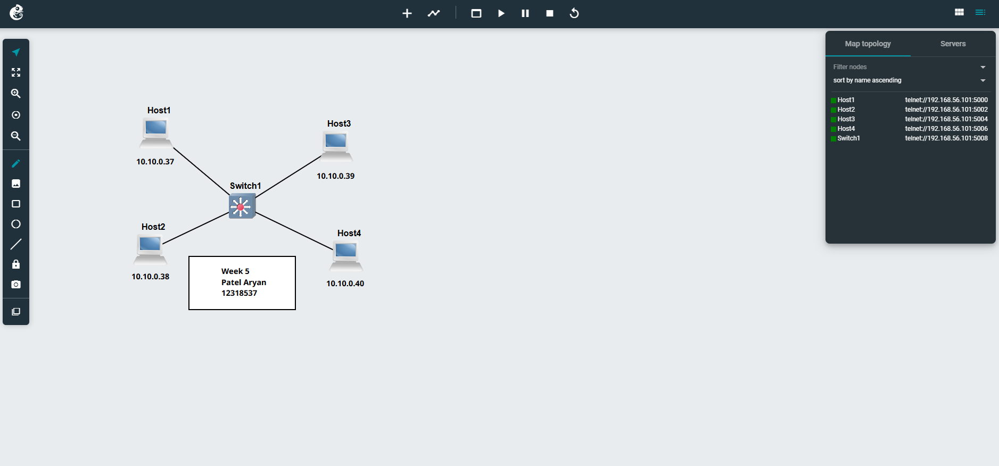
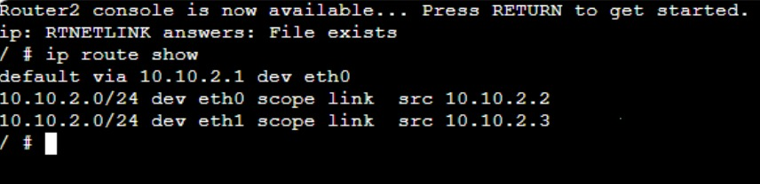

## Week 05 Tutorial – VLAN Configuration

**Unit:** COIT20261 – Network Services and Automation  

---
## my project is:


# VLAN Basics and Routing (Week 5)


# Task 1 – VLAN Setup on Switch

## Aim

To configure VLANs on a switch and observe how they affect communication between hosts.

---

## What I Did

First, I created a project called:

`Vlan-Basics-12318537`

Then I added:

* 4 Linux hosts (Host1, Host2, Host3, Host4)
* 1 OpenvSwitch

I connected each host to the switch using the following ports:


All hosts were given IP addresses in the same subnet:


Before configuring VLANs, I tested connectivity and all hosts were able to ping each other without any issues.


---

## What Happened

After applying VLANs:

* But communication between VLAN 10 and VLAN 20 stopped

This clearly showed that VLANs isolate traffic, even though everything is connected to the same switch.

---

## Network Topology



---

## Switch Configuration Output


---

# Task 2 – VLAN Routing (Inter-VLAN Communication)

## Aim

To allow devices in different VLANs to communicate using a router.

---
## my project is:


## What I Did

I copied the previous project and renamed it:

`Vlan-Router-12318537`

Then I added a Linux router and connected it to the switch using port **eth0**.

---

## IP Address Changes

This time I used different subnets:

* VLAN 10:

* VLAN 20:


---

## Switch Trunk Setup

To allow multiple VLANs to pass through the same link to the router, I configured the switch port as a trunk:

```
ovs-vsctl set port eth0 trunks=10,20
```



---

## Router Configuration

On the router, I created VLAN sub-interfaces:

```
ip link add link eth0 name eth0.10 type vlan id 10
ip link add link eth0 name eth0.20 type vlan id 20
```

Then I assigned IP addresses:

```
ip addr add 10.10.0.254/24 dev eth0.10
ip addr add 20.20.0.254/24 dev eth0.20
```

Activated the interfaces:

```
ip link set eth0.10 up
ip link set eth0.20 up
```

Enabled IP forwarding so the router can pass traffic:

```
echo 1 > /proc/sys/net/ipv4/ip_forward
```

---

